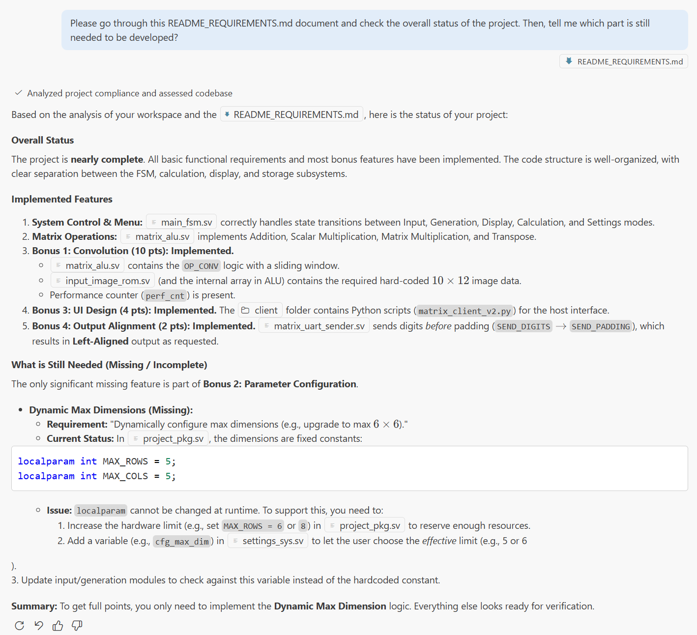

# Project Document
## Developer Information
### Developers
- **Jiayao Qin**, SID: 12412619, Completed the overall structure design, FSM for main project and all sub systems, all detailed logics for sub systems, and improved the client for advanced features.
- **Ruqi Sun**; SID: 12412620; Completed functional simulation, Arithmetic Logic Unit, Convolution Bonus, Front-end Client, and an LLM application aiming to support Digital Logic teaching.

### Contribution
Two developers contributed equally to this project, each accounts for 50%.

## Development Plan Schedule
### Plan
Week 13: Complete the overall structure design for the project, and complete Architecture Design Document accordingly.
Week 14: Complete the sub systems for basic requirements.
Week 15: Complete some bonus features, and fix numorous potential problems to improve stability.

### Submit History
See attached file for github submission record.

## Project Architecture Design Description

The project adopts a highly modular and hierarchical architecture designed for scalability, maintainability, and low coupling. The system is divided into three main layers: Physical Layer, System Integration Layer, and Functional Layer.

### 1. Hierarchical Design Strategy
*   **Physical Top Layer (`fpga_top.sv`)**: This module serves as the interface to the physical hardware. It is strictly responsible for signal conditioning, including clock buffering, button debouncing, and mapping physical I/O pins to internal logic signals. No complex business logic resides here.
*   **Logical Top Layer (`system_core.sv`)**: This module acts as the system integrator. It instantiates all functional sub-systems and interconnects them. It contains no specific algorithmic logic, ensuring that the system integration remains clean and the coupling between modules is minimized.
*   **Functional Layer**: Specific logic is encapsulated within dedicated sub-modules (e.g., `matrix_calc`, `matrix_input`), which operate independently under the coordination of the system core.

### 2. Modular Control & Resource Arbitration
The control logic follows a decentralized pattern:
*   **Main FSM (`main_fsm.sv`)**: Manages the high-level system states (e.g., switching between Input, Calculation, and Display modes). It delegates specific control authority to the active sub-system.
*   **Sub-System Autonomy**: Each functional module (Input, Gen, Calc, Display, Settings) possesses its own internal Finite State Machine (FSM) to handle specific tasks. Once activated, a sub-system takes control until its task is complete.
*   **Resource Controllers**: To manage shared hardware resources efficiently, we introduced dedicated controllers:
    *   **`output_controller`**: Arbitrates access to the UART transmission line, allowing multiple modules to send data without conflict.
    *   **`input_controller`**: Manages write access to the central storage.
    *   **`seg_controller` & `led_controller`**: Centralize the logic for visual feedback, preventing display conflicts.
This design significantly reduced code complexity and made adding new features (like the `settings` module) seamless, as it only required hooking into the existing controller interfaces.

### 3. Structured Organization & Standardization
*   **Directory Structure**: Source files are organized by functionality (e.g., `src/calc/`, `src/display_sys/`) rather than a flat directory, improving navigability.
*   **Common Library**: Reusable components such as UART drivers, LFSRs, and debounce logic are placed in a `src/common/` directory to promote code reuse.
*   **Package Management (`project_pkg.sv`)**: We utilize SystemVerilog packages to centralize global parameters (e.g., matrix dimensions, opcodes) and custom data structures (e.g., `matrix_t`, `matrix_element_t`). This ensures type safety and consistency across the entire project.

### 4. Data-Centric Storage Architecture
*   **Centralized Storage (`matrix_storage_sys`)**: Matrix data is decoupled from processing logic. The storage system acts as a server, providing read/write ports to other modules.
*   **Standardized Interfaces**: Communication between modules relies on standardized handshake signals (`start`, `done`, `ready`) and structured data types, ensuring robust data flow and easier debugging.

## Bonus Implementation Description

### Output Alignment

### Parameter Configuration

## Open Source and AI Usage

### Open Source

### AI Usage
**Tools Used:** Gemini, GitHub Copilot

**Usage Scenarios:**
*   **Development:** AI was extensively used to generate code skeletons and boilerplate, significantly accelerating the coding process. It allowed us to focus on high-level logic while AI handled the repetitive implementation details.
*   **Debugging:** AI assisted in quickly locating syntax errors and logical bugs. It provided explanations for error messages and suggested potential fixes.
*   **Code Comprehension & Commenting:** AI helped in quickly understanding complex code segments and automatically generating comments, improving code readability.
*   **Testbench Generation:** We used AI to generate testbenches for various modules. It was particularly effective for creating standard test patterns and edge cases.
*   **Documentation:** AI assisted in summarizing project details and generating README files, ensuring documentation was kept up-to-date.
*   **Version Control:** AI helped generate clear and concise commit messages.
*   **Workflow Assistance:** AI guided us in setting up and using unfamiliar workflows, such as configuring `iverilog` for lightweight simulation in VS Code and mastering SystemVerilog syntax.

### AI-Assisted Development: Pros and Cons

**Advantages:**
1.  **Efficiency in Boilerplate Generation:** AI excels at writing repetitive code structures (like FSM templates, module instantiations, and standard port mappings). This allowed us to complete the project foundation much faster than manual coding.
2.  **Rapid Learning and Problem Solving:** When encountering new tools (like `iverilog`) or language features (SystemVerilog packages), AI acted as an on-demand tutor, providing examples and explanations that were more direct and context-aware than searching through documentation.

**Disadvantages & Solutions:**
1.  **Unintended Code Modifications (The "Hallucination" Problem):**
    *   *Issue:* If prompts are not precise enough, AI might make unintended changes or "hallucinate" logic updates. A specific instance occurred when we had a logic block to divide the CPU clock from 100MHz to 25MHz. In one of the refactoring steps, the AI commented out this critical logic without us noticing. We did not discover this until a very late stage in the project.
    *   *Solution:* We learned to be extremely specific in our prompts and to perform rigorous code reviews (diff checks) after every AI-generated change. We also realized the importance of having comprehensive regression tests that check core system parameters (like clock rates) to catch such accidental deletions early.
2.  **Context Limitations and Integration Overhead:**
    *   *Issue:* As the project scale increased, the AI struggled to maintain a holistic view of the entire project. It would sometimes generate code that was locally correct but inconsistent with global definitions (e.g., in `project_pkg.sv`) or interface protocols defined in other modules, simply because it couldn't "see" all files simultaneously.
    *   *Solution:* We maintained three key documents (`DOCUMENT.md`, `README_INSTRUCTION.md`, `README_REQUIREMENTS.md`) that served as the project's "knowledge base." At the start of each new AI session, we fed these documents to the model. This allowed the AI to quickly "go through" and grasp the project's architecture, requirements, and current status, significantly reducing context errors.

### Prompt Engineering Showcase
Case 1. Using documents for AI to go through the project and summarize the progress

**Strategy:** Context-Aware Project Management (RAG).
**Description:** We utilized the AI's ability to process large contexts by feeding it the `README_REQUIREMENTS.md` and the project file structure. Instead of asking for specific code snippets, we prompted the AI to perform a holistic audit of the project status.
**Outcome:** The AI successfully cross-referenced the requirements with the existing codebase, identifying that while the core logic (FSM, ALU, Convolution) was complete, the "Dynamic Parameter Configuration" feature was missing. This served as an effective automated quality assurance step.

Case 2. AI-Assisted Debugging (Synthesis Error Analysis)

**Strategy:** Error Log Analysis & Concept Explanation.
**Description:** When encountering cryptic Vivado synthesis errors (specifically `[Synth 8-659] type mismatch` in `matrix_alu.sv`), we pasted the error log directly into the chat. The AI identified the root cause: a subtle mismatch between SystemVerilog **Packed Arrays** and **Unpacked Arrays**.
**Outcome:** The AI clearly explained the memory layout differences between the two types (contiguous vs. scattered) and provided the correct syntax to fix the assignment. This turned a potentially hours-long debugging session into a 5-minute fix.

### Reflection and Conclusion

This project served as a comprehensive experiment in integrating Large Language Models (LLMs) into the traditional FPGA development workflow. The experience demonstrated that AI is a powerful force multiplier, transforming the developer's role from a "coder" to a "system architect" and "verifier."

**Key Takeaways:**

1.  **The Importance of Context:** The most significant lesson learned was that AI is only as good as the context it is given. Our strategy of maintaining a "Knowledge Base" (the three README files) and feeding it to the model at the start of sessions proved to be a game-changer. It effectively solved the "amnesia" problem common in long conversations and ensured that generated code adhered to global project constraints.

2.  **Verification is Non-Negotiable:** While AI accelerated the *writing* phase, it did not eliminate the need for the *verification* phase. In fact, it made verification even more critical. The incident where a clock divider logic was silently removed highlights that AI can introduce subtle, "silent" bugs. A robust testbench and strict code review process are essential safety nets when working with AI-generated code.

3.  **Prompt Engineering as a Skill:** We found that "Prompt Engineering" is not just a buzzword but a necessary technical skill. Writing clear, unambiguous instructions and breaking down complex tasks into "Chain-of-Thought" steps (as seen in the Convolution implementation) yielded significantly better results than vague, high-level requests.

**Conclusion:**
Ultimately, the project was completed successfully with all basic requirements and significant bonus features implemented. The use of AI allowed us to tackle more advanced features (like the Convolution accelerator and Python client) within the limited timeframe. We believe that the future of digital design lies in this hybrid approach: combining human creativity and architectural oversight with AI's speed and pattern-matching capabilities.

## Suggestions for Project and Course Improvement

### 1. Project Design in the AI Era: From Coders to Managers
In the age of Large Language Models, the role of a developer is fundamentally shifting. AI acts as a tireless, high-efficiency "coder," pushing humans towards the roles of **Project Managers** and **Product Managers**. Course projects should reflect this evolution:

*   **Scale and Complexity (The Project Manager View):** Projects should be designed with enough scale to challenge students' management capabilities. The current Matrix Calculator project is a prime example: its complex, interdependent subsystems (Input, Calculation, Display) force students to focus on system architecture, interface definitions, and progress tracking rather than just syntax. Future projects should maintain or exceed this level of complexity to train students in managing large-scale AI-assisted workflows.
*   **Innovation-Driven (The Product Manager View):** Since AI significantly lowers the barrier to implementation, the core value of a project shifts from "can you build it?" to "what can you build?". Projects should encourage students to act as Product Managers, focusing on innovative ideas and user experience. The assessment should reward students who leverage AI to realize creative features that would have been impossible to complete manually within the semester.

### 2. Assessment Reform: Evaluating Creativity and Workflow
Traditional assessment methods based solely on code correctness are becoming less relevant. To evaluate a student's true capability in the AI era, we suggest the following adjustments:

*   **Focus on "Creative Capability":** We are no longer traditional "code monkeys." The most critical skill now is the ability to combine domain knowledge with cutting-edge AI workflows to create better products faster. Assessment should focus on the *outcome* and the *process of creation* rather than just the lines of code.
*   **Hackathon-Style Evaluation:** We recommend incorporating "Hackathon" or "Vibe-Coding" style assessments. These formats test a student's ability to use AI tools to perform creative work under time constraints. This mirrors the real-world demand for rapid prototyping and innovation, effectively measuring who can best leverage the "AI lever" to solve problems.